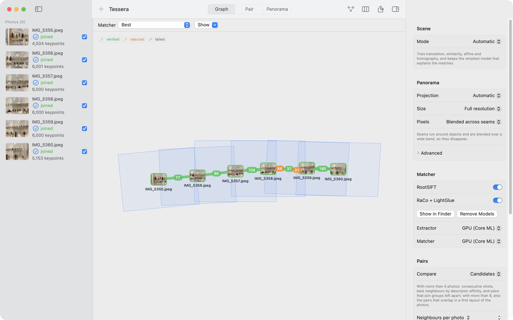
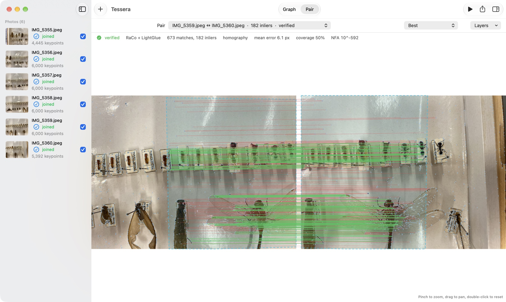
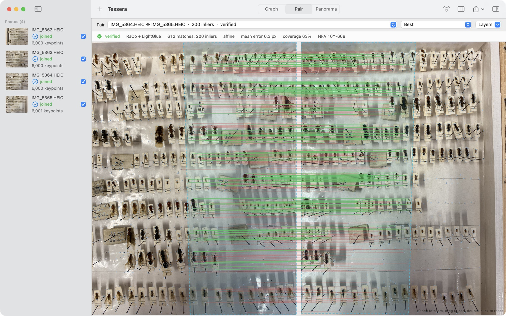

# Tessera

Tessera is a macOS app that shows how your photos fit together before you stitch them: which points it matched between two photos, which of those survived geometric verification, and which photos ended up connected to which. It is built for panoramas, for mosaics of flat subjects shot under a microscope or a macro lens, and for documents photographed in pieces.

When a stitcher fails it usually says something like "not enough similarities". Tessera tells you which pair failed, why (too few matches, a transform that folds the image, inliers bunched on a strip of repeated labels, a result indistinguishable from chance), and shows you the matches so you can see it for yourself.

> **Status:** Tessera currently does the analysis part of stitching: features, matching, verification and the photo graph. Warping, seam finding and blending into a final panorama are the next milestone.





Hundreds of near-identical labels in a box of pinned ants. LightGlue still finds 207 consistent matches, and the a-contrario test confirms them:



## What it does

- **Two matchers side by side:** RootSIFT (classical, exact nearest neighbours on the CPU) and RaCo-ALIKED + LightGlue (learned, on the GPU through Core ML). Each pair keeps the evidence from both so you can compare them.
- **Pair view:** two photos with their keypoints, tentative matches, inliers and outliers, and the overlap region, each on its own layer. Hover a point to see its match, score and reprojection error.
- **Graph view:** photos are placed where they actually sit in the mosaic, with an edge for every verified pair (thickness by inlier count) and dashed edges for pairs that were tried and rejected. Click an edge to open the pair.
- **Explicit reasons:** every photo left out gets a reason: unreadable file, too few features, no verified pair, only weak links, a separate group, or excluded by you.
- **Motion models per scene:** rotation (homography) for landscapes, translation, similarity or affine for tiles of a plane, affine or homography for documents, or automatic selection of the simplest model that explains the matches.
- **Candidate pairs:** with more than four photos Tessera does not match every pair: it ranks pairs by a quick descriptor affinity, keeps consecutive shots, the best neighbours of each photo and a spanning tree, then retries the most promising pairs between groups that remain apart.
- **JSON report:** every run can be exported with keypoints, matches, inlier sets, transforms, overlap polygons and verdicts.

## Requirements

- A Mac with Apple Silicon (M1 or later).
- macOS 27 or later (Homebrew's OpenCV and ONNX Runtime are built for it).
- Xcode 27 or later and [Homebrew](https://brew.sh). There is no prebuilt app yet: Tessera links the Homebrew libraries, so for now it is built from source.

## Building from source

```bash
brew install opencv onnxruntime
git clone https://github.com/Camponotus-vagus/Tessera.git
cd Tessera
tools/make-app.sh            # builds build/Tessera.app
open build/Tessera.app
```

The app does not include the learned models. RootSIFT works without them; RaCo-ALIKED + LightGlue needs them, and the app offers to download them (about 28 MB, once) from the empty window or from the Matcher settings. It fetches the release listed in `tools/models.json`, checks its SHA-256 and installs it in `~/Library/Application Support/Tessera/Models`, where the settings can also show or remove it. From the command line, `stitchbench --download-models` installs the same files in the same place, and `tools/fetch-models.sh` unpacks them into `Models/` of the checkout, which the tests and `stitchbench` also find. The models can be regenerated from the original PyTorch weights too: see [tools/export/README.md](tools/export/README.md).

`stitchbench`, a command-line driver of the same engine, prints a text summary and can write the JSON report and one PNG per pair:

```bash
cd Packages/StitchKit
swift build -c release
.build/release/stitchbench --source both --out /tmp/report path/to/photos/*.jpg
```

## How it works

1. **Features:** RootSIFT runs on the CPU while RaCo-ALIKED runs on the GPU. The extractor is split in three: Core ML computes the score map, the ranker map and ALIKED's feature levels; ONNX Runtime selects the keypoints; a small C++ routine evaluates the descriptor head only at the pixels it needs.
2. **Candidate pairs:** a mutual-nearest-neighbour count between the best 512 descriptors of each photo ranks the pairs.
3. **Matching:** RootSIFT with Lowe's ratio test and a mutual check, computed as one matrix product with Accelerate; LightGlue on Core ML. Consecutive shots are matched while extraction is still running.
4. **Verification:** MAGSAC++ (OpenCV USAC) for each candidate model, then an a-contrario test (number of false alarms), a check that the inliers cover more than a strip, and a plausibility check on the transform.
5. **Graph:** connected components of the verified pairs, laid out by chaining the pairwise transforms along a maximum spanning tree.

More detail in [docs/ARCHITECTURE.md](docs/ARCHITECTURE.md). Timings on an M5 MacBook Air are in [docs/BENCHMARKS.md](docs/BENCHMARKS.md): six 12-megapixel photos take about one second with both matchers.

## Roadmap

- Global alignment (bundle adjustment) and warping to rectilinear, cylindrical, spherical and planar projections.
- Seam finding and multi-band blending, with an export that keeps original pixel values for measurements.
- Phase correlation and grid priors for low-texture microscope tiles; flat-field correction.
- Manual control points and masks.

## Support

Tessera is free and open source. If it saves you time, you can support its development on [Ko-fi](https://ko-fi.com/zermat) or through [GitHub Sponsors](https://github.com/sponsors/Camponotus-vagus).

## Credits and license

Tessera is released under the [MIT License](LICENSE). It builds on OpenCV, ONNX Runtime, RaCo, ALIKED, LightGlue and LightGlue-ONNX; see [THIRD_PARTY_NOTICES.md](THIRD_PARTY_NOTICES.md).
