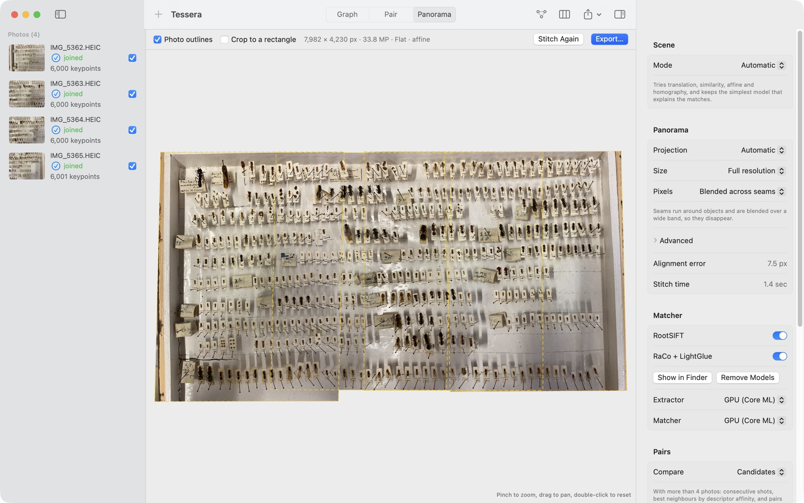
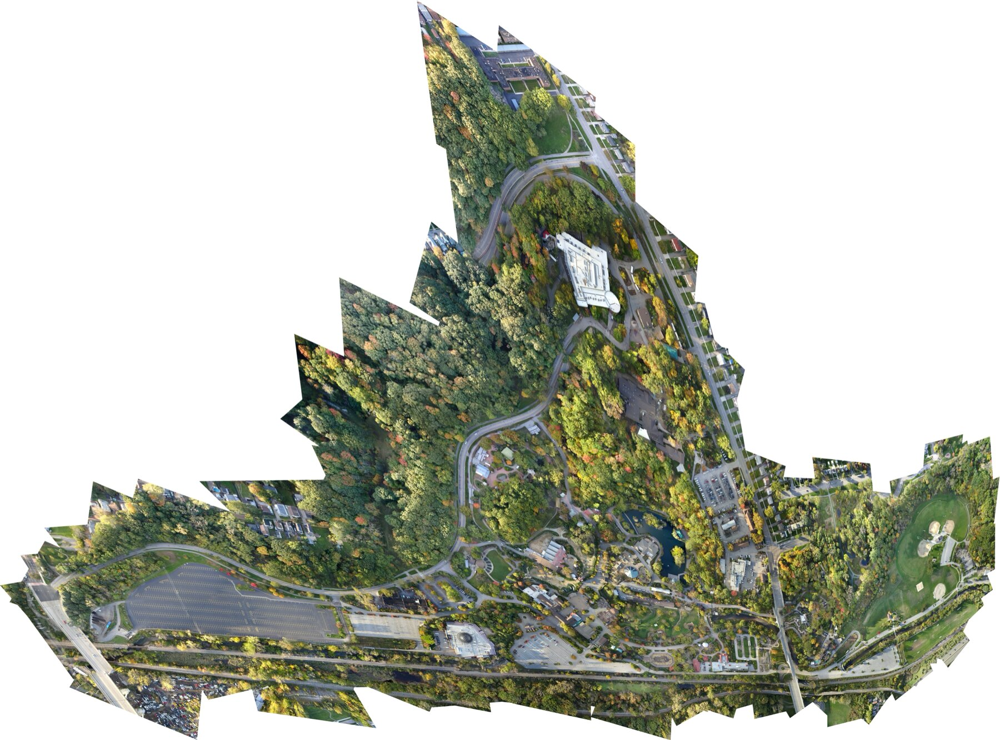

# Tessera

Tessera is a macOS app that joins photos into panoramas and mosaics and shows you how they fit together. It is made for landscapes shot by turning the camera, for mosaics of flat subjects photographed under a microscope or a macro lens, and for documents photographed in pieces.

When a stitcher fails, it often says little more than "not enough similarities". Tessera tells you which pair failed and why (too few matches, a transform that folds the image, inliers bunched on a strip of repeated labels, a result indistinguishable from chance), and it shows you the matches so you can check for yourself. When the photos connect, it aligns and blends them into one panorama, which you can export as JPEG, PNG, TIFF or HEIC.




Hundreds of near-identical labels in a box of pinned ants. LightGlue still finds 200 consistent matches, and the a-contrario test confirms them:


## Large sets

Tessera handles sets of hundreds of photos. This mosaic is made from 491 of the 524 photos of OpenDroneMap's [zoo survey](https://github.com/OpenDroneMap/odm_data_zoo) (CC0 test data, 18 megapixels each), stitched at an eighth of full resolution: 511 photos connect, and the alignment leaves out 20 of them as misplaced, mostly treetops.



| Set | Photos joined | Result | Analysis + stitching on a MacBook Air M5 |
|---|---|---|---|
| Drone survey of a zoo, 18 MP photos | 491 of 524 (511 connect) | flat mosaic, 15.4 px alignment error | 4.5 + 1.6 min, at an eighth |
| Drone survey of farm fields, 9.7 MP photos | 162 of 167 | flat mosaic, 7.6 px | 79 + 16 s, at a quarter |
| NIST microscope tiles, 16-bit | 100 of 100 | 12713 x 9526 px (121 MP), 0.78 px | 18 + 9 s (0.1.3) |
| PTGui's Paris example, robotic head | 51 of 79 (the rest is plain sky) | 13548 x 7856 px after cropping, 1.35 px | 31 + 19 s (0.1.3) |

At a quarter of full resolution the zoo mosaic comes out at 20501 x 15184 pixels (311 megapixels), stitched in about two minutes after the analysis, against six with 0.1.3. To fit in the memory of a 32 GB Mac, Tessera made it at 93% of the requested size. The figures and what limits each set are in [docs/BENCHMARKS.md](docs/BENCHMARKS.md).

## Download

Tessera runs on Macs with Apple Silicon (M1 or later) and macOS 15 Sequoia or later.

1. Download `Tessera-0.1.4.dmg` from the [latest release](https://github.com/Camponotus-vagus/Tessera/releases/latest), open it and drag Tessera to Applications.
2. Open Tessera. The first time, macOS refuses to open it and says it could not verify that Tessera is free of malware. This happens because Tessera is signed without a paid Apple Developer ID, so Apple has not notarized it. Click Done.
3. Open System Settings, go to Privacy & Security and scroll down to Security. Next to "Tessera was blocked to protect your Mac", click Open Anyway and confirm with your password. macOS remembers this, and Tessera opens normally from then on.

If you prefer the Terminal, removing the quarantine flag that macOS puts on downloaded files has the same effect:

```bash
xattr -dr com.apple.quarantine /Applications/Tessera.app
```

The release also lists the SHA-256 of each file in `SHA256SUMS`, so you can check your download with `shasum -a 256 Tessera-0.1.4.dmg`.

## First launch

Tessera works right away with RootSIFT, the classical matcher. The learned matcher, RaCo-ALIKED + LightGlue, finds more matches on difficult photos and needs its models, 28 MB that are not part of the app. Click Download Models in the empty window or in the Matcher settings. Tessera downloads them once from this repository's releases, checks their SHA-256 and keeps them in `~/Library/Application Support/Tessera/Models`; the Matcher settings can show them in the Finder or remove them.

## Using it

1. Drop the photos on the window, or click Import Photos. A video swept over the subject works too: Tessera reads every frame and keeps the sharpest one in each step of a third of a frame (frames are kept in `~/Library/Caches/Tessera/Frames`, so a second import of the same video is immediate).
2. Click Stitch (⇧⌘R). Tessera analyses the photos, aligns the largest group of connected photos and blends it into one image, which appears in the Panorama view (⌘3). Photo outlines draws where each photo landed, and Crop to a rectangle keeps the largest rectangle without empty corners.
3. Click Export… above the panorama, or choose File > Export Panorama… (⌘E). JPEG and HEIC have a quality setting. PNG and TIFF can keep 16 bits per channel and, when the panorama is not cropped, a transparent background around it.

If some photos are left out, the Graph view (⌘1) says why for each of them; photos that the alignment leaves out are listed with the reason under the panorama. Clicking an edge opens the Pair view (⌘2) with the matches between those two photos, and Analyze (⌘R) runs only this part, without stitching.

The settings inspector has, among others:

- Mode: Automatic, Rotation for a camera that turns on the spot, Plane for tiles of a flat subject (microscope slides, insect drawers), or Document for a flat original shot from different angles.
- Projection, for rotation panoramas: Rectilinear, Cylindrical or Spherical. Automatic picks rectilinear for narrow fields of view, cylindrical for wide ones and spherical when the panorama is also tall. Planar mosaics and documents are always flat.
- Size: full resolution, half or a quarter.
- Pixels: Blended across seams (seams follow the edges of objects and are blended over a wide band), or Original values, where each pixel comes from a single photo. For measurements, set Exposure to Unchanged under Advanced as well, so that no gain is applied: at full resolution each pixel is then interpolated from one photo by the warp (bicubic), without gains or blending (at Half or Quarter size the photos are scaled down first). Photos that do not share one colour space are converted to Display P3.

## Command line

`stitchbench` runs the same engine from the Terminal. It prints a summary of every photo and pair, and can write the JSON report, one PNG per pair and the panorama:

```bash
cd Packages/StitchKit
swift build -c release
.build/release/stitchbench --source both --out /tmp/report path/to/photos/*.jpg
.build/release/stitchbench --stitch /tmp/panorama.tif --projection cylindrical path/to/photos/*.jpg
```

`stitchbench --download-models` installs the learned models in the same place as the app. Given a single video, `stitchbench` chooses its frames as the app does (`--frames dir` writes them there instead of the caches).

## Building from source

You need a Mac with Apple Silicon, Xcode with Swift 6.1 or later (Tessera is developed with Xcode 27) and [Homebrew](https://brew.sh) for CMake and Ninja.

```bash
brew install cmake ninja
git clone https://github.com/Camponotus-vagus/Tessera.git
cd Tessera
tools/build-opencv.sh
tools/make-app.sh
open build/Tessera.app
```

`tools/build-opencv.sh` downloads the OpenCV 5.0.0 source, checks its SHA-256 and builds the six modules Tessera uses as static libraries in `Vendor/opencv`, which takes a few minutes. The app then depends on nothing outside macOS. `tools/make-release.sh` builds the zip and the DMG of a release, and `swift test` in `Packages/StitchKit` runs the tests.

ONNX Runtime is optional. With `brew install onnxruntime` and `TESSERA_TRAITS=onnx tools/make-app.sh` (or `swift build --traits ONNXRuntime`), the learned models can also run on the CPU, and `stitchbench --onnx-select` uses the original ONNX keypoint selection instead of the C++ one. The models can be regenerated from the PyTorch weights with the scripts in [tools/export](tools/export/README.md).

## How it works

1. Features: RootSIFT runs on the CPU while RaCo-ALIKED runs on the GPU. The learned extractor is split in three: Core ML computes RaCo's score and ranker maps and ALIKED's feature levels, C++ selects the keypoints, and a small C++ routine evaluates ALIKED's descriptor head only at the pixels it needs.
2. Candidate pairs: with more than four photos, a mutual-nearest-neighbour count between the best 512 descriptors of each photo ranks the pairs, and Tessera matches consecutive shots, the best neighbours of each photo and a spanning tree, then retries promising pairs between groups that remain apart. With more than eight photos it also matches the pairs that overlap in a provisional layout of the photos.
3. Matching: RootSIFT with Lowe's ratio test and a mutual check, computed as one matrix product with Accelerate; LightGlue on Core ML.
4. Verification: RANSAC for translation and similarity and MAGSAC++ (OpenCV USAC) for affine and homography, then an a-contrario test (number of false alarms), a check that the inliers cover more than a strip, and a plausibility check on the transform.
5. Graph: connected groups of verified pairs, with a reason for every photo left out.
6. Global alignment: planar mosaics are solved by weighted least squares on the inliers of all verified pairs (translation, similarity or affine), or by Levenberg-Marquardt for homographies. Rotation panoramas use OpenCV's bundle adjuster, starting from the EXIF focal length when every photo has one, and wave correction to level the horizon. Pairs whose loops of three photos do not close are left out first, with any photo that only they join; after solving, pairs that disagree with the rest are dropped while the group stays connected. In Automatic mode, sets of 40 photos or more can also leave out up to 5% of their photos when the homographies place them implausibly.
7. Compositing: each photo is warped to the chosen projection, exposure is compensated per photo and colour channel, a graph cut places the seams around objects, and multi-band blending hides them. The result keeps 16 bits per channel, and its largest rectangle without empty corners is found exactly up to 60 megapixels.

More detail in [docs/ARCHITECTURE.md](docs/ARCHITECTURE.md). Timings on an M5 MacBook Air are in [docs/BENCHMARKS.md](docs/BENCHMARKS.md): six 12-megapixel photos are analysed in about a second and stitched in about two more.

## Roadmap

- Panoramas that close the full circle (360 degrees), and loop closure for long sequences.
- Phase correlation and grid priors for microscope tiles with little texture; flat-field correction.
- Manual control points and masks.
- Panorama metadata (GPano) and the photos' EXIF data in exported files.

## Support

Tessera is free and open source. If it saves you time, you can support its development on [Ko-fi](https://ko-fi.com/zermat) or through [GitHub Sponsors](https://github.com/sponsors/Camponotus-vagus).

## Credits and license

Tessera is released under the [MIT License](LICENSE). It builds on OpenCV, RaCo, ALIKED, LightGlue and LightGlue-ONNX, and optionally ONNX Runtime; see [THIRD_PARTY_NOTICES.md](THIRD_PARTY_NOTICES.md). The app contains these licenses in `Tessera.app/Contents/Resources/Licenses`.
